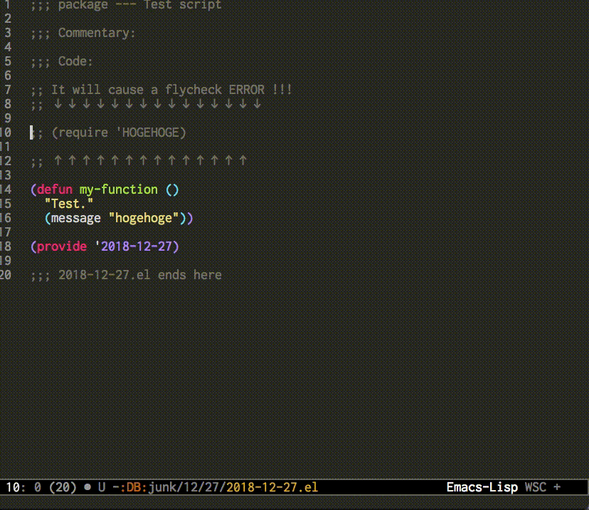

# Flycheck flash mode line

Flash mode line when flycheck detects errors !!

## How It Works

When flycheck detects errors, mode line will flash instantly.



## Usage

In your `init.el`, write code as bellow.

```elisp
(add-to-list 'load-path "YOUR PATH")
(require 'flycheck-flash-mode-line)

;; enable minor mode
(flycheck-flash-mode-line t)
```

When flycheck detects errors, mode line will flash !!

## Customize

If you want to change the flash color

```elisp
(setq ffml--mode-line-color "YOUR FAVORITE COLOR")
```
